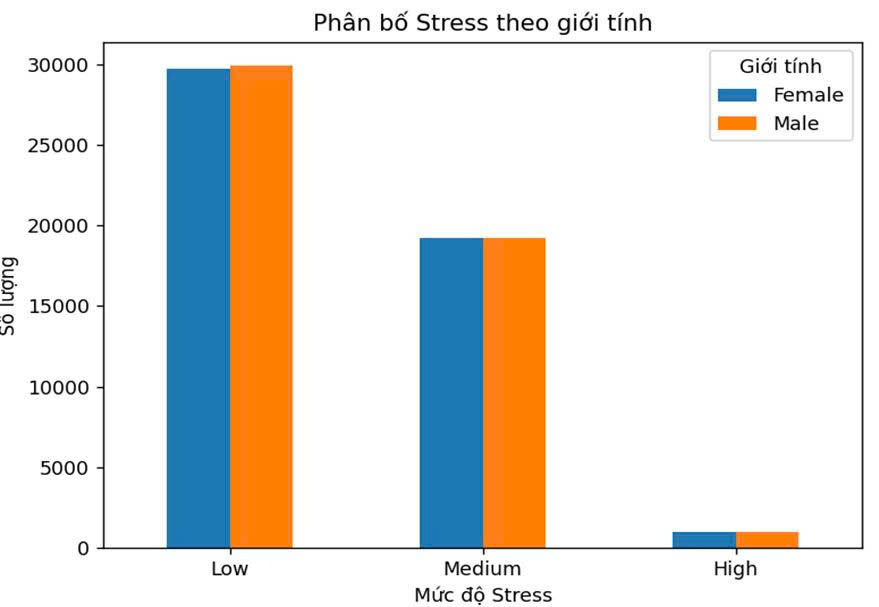
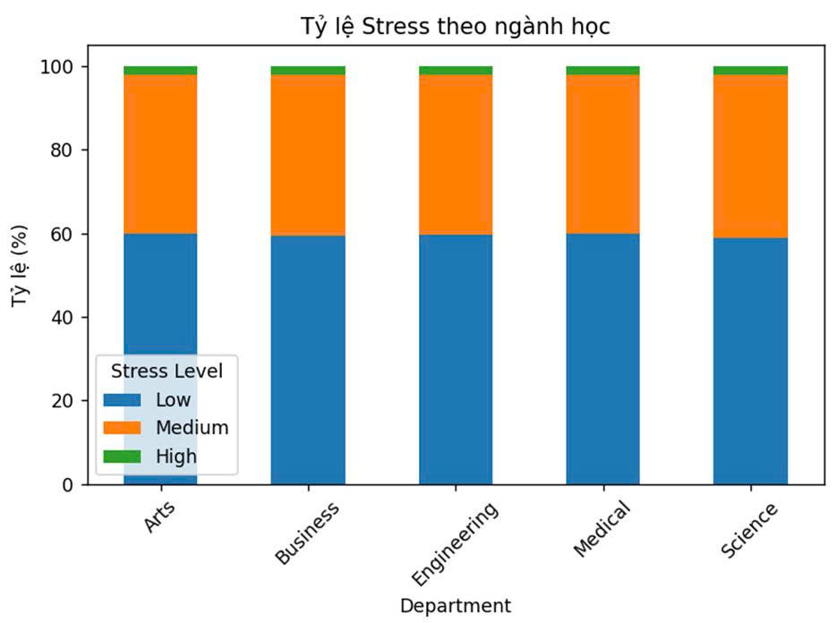
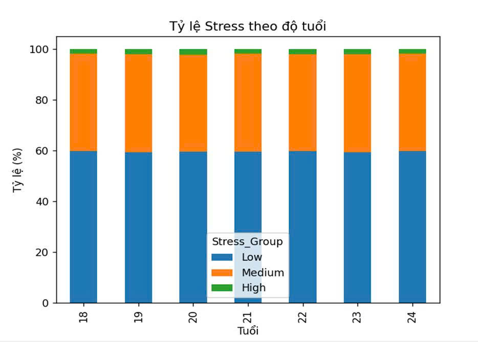
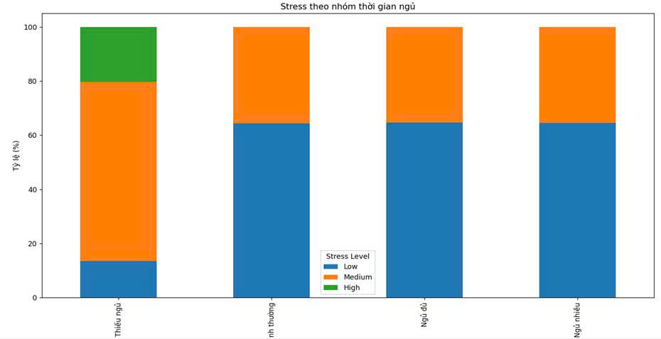
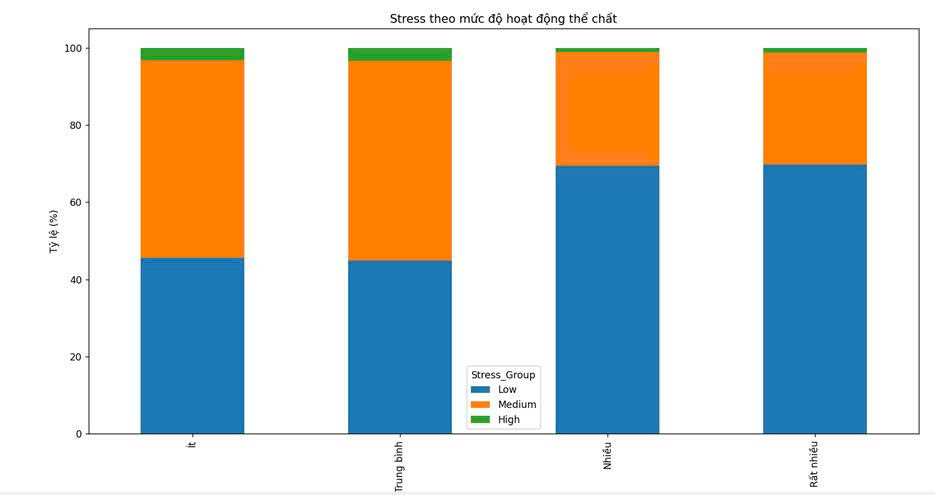
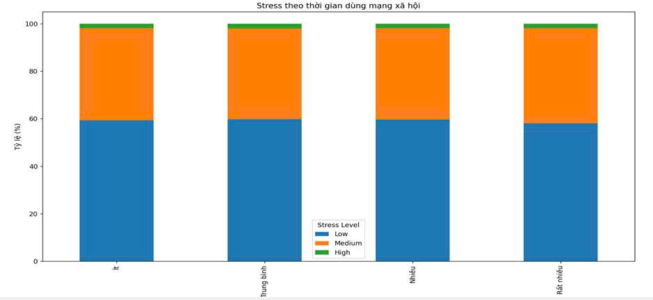

# 1.1. Giới thiệu về tập dữ liệu

## Bộ dữ liệu
Sức khỏe tâm thần đang trở thành mối quan tâm ngày càng lớn trong giới học thuật. Bộ dữ liệu này mô phỏng một cuộc khảo sát quy mô lớn với **100.000 sinh viên đại học**, tập trung vào thói quen sinh hoạt, kết quả học tập và sức khỏe tâm thần của họ. 

Bộ dữ liệu được thiết kế để cung cấp nguồn tài nguyên phong phú cho các nhiệm vụ:
* **Phân tích Dữ liệu Khám phá (EDA)**
* **Phân loại (Classification)**
* **Hồi quy (Regression)**

Nó cho phép các nhà nghiên cứu và những người đam mê khoa học dữ liệu điều tra mối tương quan giữa mô hình giấc ngủ, thói quen học tập và việc sử dụng mạng xã hội với thành tích học tập (điểm trung bình tích lũy - CGPA) và các vấn đề sức khỏe tâm thần (Trầm cảm & Căng thẳng).

## Nguồn dữ liệu
Nguồn dữ liệu được trích xuất từ Kaggle: [Student Depression and Lifestyle (100k Data)](https://www.kaggle.com/datasets/aldinwhyudii/student-depression-and-lifestyle-100k-data/data)

## Các thuộc tính chính (Data Dictionary)

| Tên cột | Mô tả | Kiểu dữ liệu |
| :--- | :--- | :--- |
| **Student_ID** | Mã định danh duy nhất cho mỗi học sinh. | Integer |
| **Age** | Độ tuổi của sinh viên (18-24). | Integer |
| **Gender** | Giới tính của học sinh (Nam/Nữ). | String |
| **Department** | Ngành học (Kỹ thuật, Kinh doanh, Nghệ thuật, v.v.). | String |
| **CGPA** | Điểm trung bình tích lũy (0.0 - 4.0). | Float |
| **Sleep_Duration** | Số giờ ngủ trung bình mỗi đêm. | Float |
| **Study_Hours** | Số giờ trung bình dành cho việc học mỗi ngày. | Float |
| **Social_Media_Hours** | Số giờ trung bình mỗi ngày dành cho mạng xã hội. | Float |
| **Physical_Activity** | Số phút hoạt động thể chất trung bình mỗi tuần. | Integer |
| **Stress_Level** | Mức độ căng thẳng tự báo cáo (thang điểm 0-10). | Integer |
| **Depression** | Tình trạng sức khỏe tâm thần (`True` = Có thể bị trầm cảm, `False` = Khỏe mạnh). | Boolean |
## 2.1.1. Ảnh hưởng của Giới tính, Tuổi tác và Ngành học tới mức độ Stress

### 📊 1. Mối quan hệ giữa Giới tính và Mức độ Stress
Tìm hiểu số lượng người có mức độ stress thấp, trung bình, cao ở hai nhóm giới tính `Male` (Nam) và `Female` (Nữ).

#### Kết quả thu được:

| Giới tính | Mức độ Thấp | Mức độ Trung bình | Mức độ Cao |
| :--- | :---: | :---: | :---: |
| **Nam (Male)** | 29,888 | 19,222 | 1,010 |
| **Nữ (Female)** | 29,695 | 19,211 | 974 |

> **📌 Nhận xét:** 
> Nhìn chung tổng quan, số lượng người trầm cảm/stress theo các mức độ thấp, trung bình, cao ở cả hai giới tính là tương đương nhau và không có sự chênh lệch nhiều. Từ đó, có thể đưa ra kết luận: Trong thời đại xã hội mới khi giới tính đã bình đẳng, dù là nam hay nữ thì mức độ stress gặp phải trong cuộc sống là như nhau, không có sự thiên vị hay khác biệt quá lớn giữa hai giới.

---

### 🎓 2. Mối quan hệ giữa Ngành học và Mức độ Stress
Khám phá dữ liệu để tìm hiểu mức độ stress của sinh viên thuộc từng ngành học cụ thể sẽ như thế nào.

#### Kết quả thu được:

> **📌 Nhận xét:** 
> Nhìn chung về tổng thể, số người chịu ảnh hưởng bởi mỗi nhóm mức độ stress trong từng ngành học là như nhau. Tỉ lệ này cho thấy mức độ stress của sinh viên phân bố tương đối đồng đều giữa các ngành:
> * **Mức độ Thấp:** Chiếm phần lớn với khoảng `~60%`.
> * **Mức độ Trung bình:** Chiếm khoảng `~38%`.
> * **Mức độ Cao:** Ở mức rất thấp, chỉ chiếm khoảng từ `1% - 2%`.
> 
> Tuy nhóm đối tượng có mức độ stress cao chiếm tỷ lệ nhỏ, nhưng họ vẫn là nhóm rất cần nhận được sự quan tâm. Qua phân tích trên, chúng ta thấy **ngành học không tạo ra sự khác biệt đáng kể** về mức độ stress, mà các yếu tố cá nhân và lối sống sinh hoạt hàng ngày có thể đóng vai trò quan trọng hơn.

---

### ⏳ 3. Mối quan hệ giữa Độ tuổi và Mức độ Stress
Khám phá dữ liệu để tìm hiểu mức độ stress ở từng lứa tuổi (từ 18 đến 24 tuổi).

#### Kết quả thu được:

> **📌 Nhận xét:** 
> Phân tích theo độ tuổi cho thấy mức độ stress của sinh viên tương đối ổn định trong suốt giai đoạn từ 18 đến 24 tuổi. Không có sự khác biệt đáng kể giữa các nhóm tuổi khác nhau:
> * **Mức độ Thấp:** Chiếm khoảng `~60%`.
> * **Mức độ Trung bình:** Chiếm khoảng `~38% - 39%`.
> * **Mức độ Cao:** Chỉ chiếm tỉ lệ rất nhỏ từ `2% - 3%`.
> 
> Điều này dẫn đến kết luận rằng **độ tuổi không ảnh hưởng nhiều** đến mức độ stress của sinh viên, thay vào đó các yếu tố khác như lối sống hay áp lực học tập thực tế mới đóng vai trò quyết định.
> ## 2.1.2. Ảnh hưởng của Số giờ ngủ, Thời gian hoạt động thể chất và Thời gian dùng mạng xã hội tới mức độ Stress

### 🛌 1. Phân tích ảnh hưởng của Số giờ ngủ tới mức độ Stress

#### Kết quả thu được:

| Nhóm giấc ngủ | Stress mức Thấp | Stress mức Trung bình | Stress mức Cao |
| :--- | :---: | :---: | :---: |
| **Thiếu ngủ** | ~16% | ~64% | ~20% |
| **Ngủ bình thường** | ~64% | ~36% | ~0.002% |
| **Ngủ đủ** | 64.7% | 35.3% | ~0.1% |
| **Ngủ nhiều** | 64.6% | 35.4% | ~0.1% |

> **📌 Nhận xét:** 
> Nhìn vào số liệu phân tích và biểu đồ tỷ lệ, ta nhận thấy mức độ stress không có sự phân biệt quá nhiều giữa nhóm người ngủ đủ, ngủ trung bình và ngủ nhiều. Tuy nhiên, có **sự phân biệt rất lớn** đối với nhóm người ngủ ít (thiếu ngủ), khi tỷ lệ stress cao vọt lên đến 20% và stress thấp giảm mạnh chỉ còn 16%. 
> 
> Theo các nghiên cứu khoa học, giấc ngủ ảnh hưởng rất lớn đến sức khỏe và đời sống sinh hoạt của con người. Người ngủ đủ giấc có xu hướng làm việc lâu dài và ổn định hơn người ít ngủ. Chính vì cơ sở đó, trong tập dữ liệu phân tích, thời gian ngủ đóng vai trò đặc biệt quan trọng tác động trực tiếp đến mức độ stress của sinh viên.

---

### 🏃‍♂️ 2. Phân tích ảnh hưởng của Thời gian hoạt động thể chất tới mức độ Stress

#### Kết quả thu được:

> **📌 Nhận xét:** 
> Biểu đồ cho thấy xu hướng rất rõ ràng về mối quan hệ giữa lối sống và sức khỏe tinh thần của sinh viên. Khi mức độ hoạt động thể chất tăng lên, tỷ lệ sinh viên có mức độ stress thấp tăng lên đáng kể, trong khi tỷ lệ stress trung bình và cao có xu hướng giảm:
> * **Nhóm ít vận động hoặc vận động trung bình:** Tỷ lệ stress thấp chỉ dao động ở mức ~45%, trong khi stress trung bình chiếm tỷ lệ lớn hơn (khoảng 50%). Điều này phản ánh thực tế khi sinh viên lười vận động sẽ dễ rơi vào trạng thái căng thẳng hơn.
> * **Nhóm vận động cao:** Tỷ lệ stress thấp tăng mạnh lên khoảng 69-70%, tỷ lệ stress trung bình giảm còn 28-30%, đặc biệt tỷ lệ stress cao chỉ còn vỏn vẹn 1-2%. Sự thay đổi này chứng minh hoạt động thể chất không chỉ giảm stress tổng thể mà còn đóng vai trò quan trọng giảm khả năng trầm cảm.
> 
> **Đáng chú ý:** Khi so sánh với các yếu tố như ngành học, độ tuổi và giới tính (vốn không cho thấy sự khác biệt đáng kể ở phân tích trước), mức độ hoạt động thể chất lại thể hiện ảnh hưởng rõ rệt và nhất quán. Điều này gợi ý rằng **các yếu tố thuộc về lối sống cá nhân đóng vai trò quan trọng hơn các yếu tố nhân khẩu học** trong việc tác động đến sức khỏe tinh thần của sinh viên.

---

### 📱 3. Phân tích thời gian hoạt động Mạng xã hội tới mức độ Stress

#### Kết quả thu được:

> **📌 Nhận xét:** 
> Biểu đồ cho thấy mạng xã hội có mối quan hệ với tình trạng stress của sinh viên, tuy nhiên mức độ ảnh hưởng không mạnh và rõ ràng như yếu tố hoạt động thể chất:
> * **Nhóm sử dụng từ "Ít" đến "Nhiều":** Tỷ lệ sinh viên có mức độ stress thấp duy trì khá ổn định, dao động quanh mức 59–60%, stress trung bình chiếm khoảng 38–39% và stress cao ở mức rất thấp (khoảng 2–3%). Việc sử dụng mạng xã hội ở mức vừa phải chưa tạo ra sự khác biệt đáng kể.
> * **Nhóm sử dụng ở mức "Rất nhiều":** Bắt đầu xuất hiện xu hướng thay đổi nhẹ. Tỷ lệ stress thấp giảm xuống còn khoảng 58%, trong khi stress trung bình có xu hướng tăng lên. 
> 
> Mặc dù sự chênh lệch này không quá lớn, nhưng nó phần nào phản ánh rằng **việc sử dụng mạng xã hội với cường độ quá cao có liên quan đến việc gia tăng mức độ căng thẳng**. Điều này có thể xuất phát từ nhiều nguyên nhân như tiếp xúc quá nhiều với thông tin tiêu cực, áp lực so sánh xã hội (FOMO), hoặc sự phụ thuộc vào các nền tảng trực tuyến.

